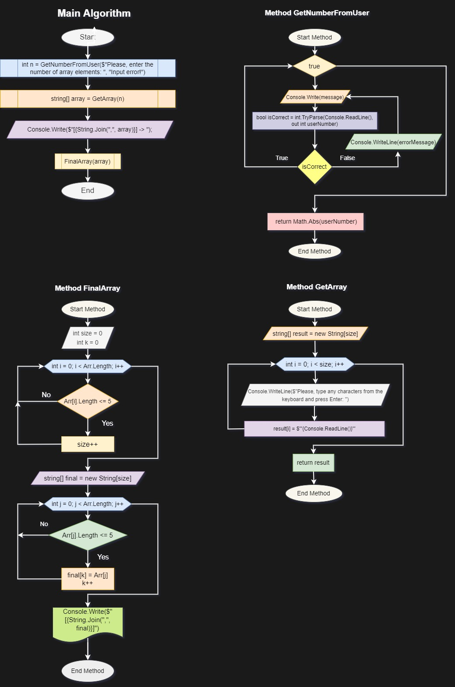

# :star: Итоговая проверочная работа (1 блок) :star:
---
## Условия задачи
Задача алгоритмически не самая сложная, однако для полноценного выполнения проверочной работы необходимо:

[1. Создать репозиторий на GitHub](#1-создать-репозиторий-на-github)

[2. Нарисовать блок-схему алгоритма](#2-нарисовать-блок-схему-алгоритма)

    (можно обойтись блок-схемой основной содержательной части, если вы выделяете её в отдельный метод)

[3. Снабдить репозиторий оформленным текстовым описанием решения](#3-снабдить-репозиторий-оформленным-текстовым-описанием-решения) (файл README .md)

[4. Написать программу, решающую поставленную задачу](#4-написать-программу-решающую-поставленную-задачу)

[5. Использовать контроль версий в работе над этим небольшим проектом](#5-использовать-контроль-версий-в-работе-над-этим-небольшим-проектом) 

    (не должно быть так, что всё залито одним коммитом, как минимум этапы 2, 3 
    и 4 должны быть расположены в разных коммитах)
---
### Задача: 

*Написать программу, которая из имеющегося массива строк формирует новый массив из строк, длина которых меньше, либо равна 3 символам. Первоначальный массив можно ввести с клавиатуры, либо задать на старте выполнения алгоритма. При решении не рекомендуется пользоваться коллекциями, лучше обойтись исключительно массивами.*

      Примеры:
      [“Hello”, “2”, “world”, “:-)”] → [“2”, “:-)”]
      [“1234”, “1567”, “-2”, “computer science”] → [“-2”]
      [“Russia”, “Denmark”, “Kazan”] → []
---
### РЕШЕНИЕ

#### 1. Создать репозиторий на GitHub
  Сейчас вы читаете текстовое описание (README .md) решения задачи, выложенное в созданный удаленный репозиторий на [GitHub (MorningAndrey/Final_Task_IT-Engineer_1st_Quarter)](https://github.com/MorningAndrey/Final_Task_IT-Engineer_1st_Quarter)

#### 2. Нарисовать блок-схему алгоритма
Решение состоит из одной блок-схемы алгоритма основной части программы и трех блок-схем алгоритмов созданных методов:
* Method GetNumberFromUser - метод запроса числа элементов массива у пользователя с проверкой на ошибки ввода.
  
* Method GetArray - метод создания первоначального массива строк и заполнения его через запрос у пользователя ввода любых символов с клавиатуры.
* Method FinalArray - метод формирования из имеющегося массива строк массива из строк, длина которых меньше, либо равна 3 символа
  

#### 3. Снабдить репозиторий оформленным текстовым описанием решения
Данный файл :star2: [README.md](https://github.com/MorningAndrey/Final_Task_IT-Engineer_1st_Quarter/blob/master/README.md) :star2: который Вы сейчас читаете, является текстовым описанием решения задачи.

#### 4. Написать программу, решающую поставленную задачу
Код программы (программа находится в ветке Master):

Вывод результата решения задачи в терминале:

#### 5. Использовать контроль версий в работе над этим небольшим проектом
Скриншоты коммитов, созданных в процессе выполнения задания:

